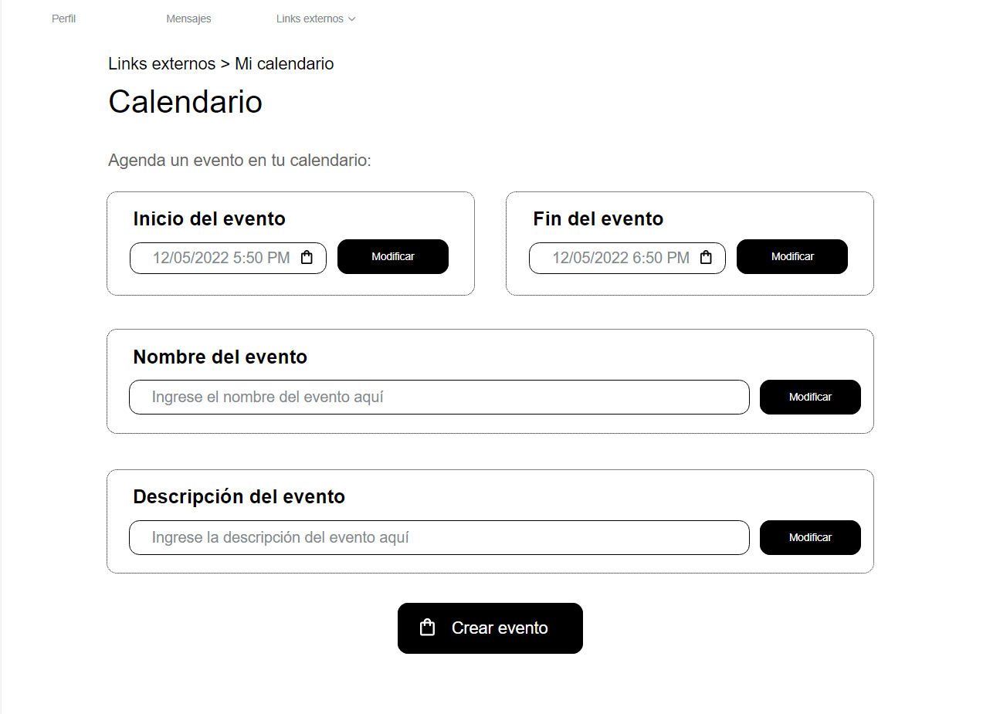

# 2.1 Requerimientos Funcionales

## Módulo de Comunicación

### **UCC1-Mensajería one-to-one:**

**Descripción:** Los usuarios podrán enviar mensajes directos a otros usuarios, independientemente de su rol.  
**Actores:** Sistema y usuarios.  
**Precondiciones:** Haber accedido a la página web. / Tener acceso a internet  
**Postcondiciones:** Envio de un mensaje directo al chat del otro usuario.  
**Activador:** Un usuario quiere enviar un mensaje directo.

### **UCC2-Mensajería de grupo:**

**Descripción:** Los usuarios podrán crear y unirse a grupos de chat, ya sean por curso, grupo de trabajo, etc.  
**Actores:** Sistema y usuarios.  
**Precondiciones:** Haber accedido a la página web. / Tener acceso a internet. / Pertenecer a un curso.  
**Postcondiciones:** Los grupos de chat son creados y se realizan envio de mensajes.  
**Activador:** Un usuario desea crear y enviar mensajes a un chat grupal.

### **UCC3-Anuncios y notificaciones:**

**Descripción:** Los profesores y el personal administrativo podrán enviar mensajes importantes a los grupos de estudiantes o a toda la institución.  
**Actores:** Sistema, profesores y personal administrativo.  
**Precondiciones:** Haber accedido a la página web. / Tener acceso a internet. / Iniciar sesión como profesor o personal administrativo.  
**Postcondiciones:** Los anuncios y notificaciones son enviados y recibidos por los estudiantes.  
**Activador:** El profesor o personal administrativo decide enviar un anuncio o notificación.

### **UCC4-Compartir archivos:**

**Descripción:** Todos los usuarios podrán compartir archivos multimedia, documentos, presentaciones, etc., dentro de los chats individuales o de grupo.  
**Actores:** Sistema y usuarios.  
**Precondiciones:** Haber accedido a la página web. / Tener acceso a internet.  
**Postcondiciones:** Los archivos compartidos están disponibles para todos los participantes del chat.  
**Activador:** Un usuario decide compartir un archivo dentro de un chat individual o de grupo.

### **UCC5-Borrado de mensajes:**

**Descripción:** Todos los usuarios podrán eliminar los mensajes posterior a su envío, pero no después de pasadas 24 horas de su envío, esto dentro de los chats individuales o de grupo.  
**Actores:** Sistema y usuarios.  
**Precondiciones:** Haber accedido a la página web. / Tener acceso a internet. / Haber enviado un mensaje.  
**Postcondiciones:** El mensaje seleccionado debe de haberse borrado del historial de mensajes.  
**Activador:** Un usuario decido eliminar un mensaje dentro de un chat individual o grupal.

### **UCC6-Indicadores de Lectura:**

**Descripción:** Todos los usuarios podrán ver el estado de su mensaje, primero si es que ha sido enviado, posterior si es que este ha sido recibido y por último, si este ha sido leido por el o los destinatarios.  
**Actores:** Sistema y usuarios.  
**Precondiciones:** Haber accedido a la página web. / Tener acceso a internet. / Haber enviado un mensaje.  
**Postcondiciones:** El mensaje en cuestión contara con un estatus en el que se entenderá si se encuentra como enviado, recibido o leido.  
**Activador:** El usuario decide corroborar en qué estado se encuentra el mensaje una vez fue enviado.

### **UCC7-Búsqueda de mensajes:**

**Descripción:** Todos los usuarios podrán buscar uno o varios mensajes que contengan una palabra clave. Por ejemplo, podrán buscar todos los mensajes que contengan la palabra "tarea".  
**Actores:** Sistema y usuarios.  
**Precondiciones:** Haber accedido a la página web. / Tener acceso a internet. / Pertenecer a un chat one-to-one o grupal. / En ese grupo debe haber al menos un mensaje.  
**Postcondiciones:** Aparecerá un menú que indique la cantidad de mensajes que contengan la palabra o frase a buscar y podrá ir a ver cada uno de estos.  
**Activador:** El usuario decide buscar un mensaje con una palabra o frase en específico.

## Módulo de Gestión de Usuarios

### **UCG1-Registro e inicio de sesión con roles definidos:**

**Descripción:** La página web debe permitir el registro e inicio de sesión de usuarios con roles específicos: profesor, alumno y personal administrativo, cada rol tendrá diferentes permisos y funcionalidades.  
**Actores:** Usuarios (alumnos, profesores, personal administrativo).  
**Precondiciones:** Una cuenta de usuario previamente registrada, la aplicación debe estar conectada a un servicio de autenticación y base de datos.  
**Postcondiciones:** El usuario tiene una cuenta creada y puede iniciar sesión en la aplicación, los datos del usuario están almacenados en la base de datos de forma segura.  
**Activador:** El usuario selecciona la opción de registro en la pantalla de inicio.

### **UCG2-Perfiles de usuario:**

**Descripción:** Cada usuario tendrá un perfil con información básica como nombre, foto de perfil, rol en la institución, etc.  
**Actores:** Usuarios (alumnos, profesores, personal administrativo).  
**Precondiciones:** El usuario debe estar autenticado en la aplicación.  
**Postcondiciones:** La información del perfil del usuario se actualiza en la base de datos. / Los cambios en el perfil se reflejan en la interfaz de usuario.  
**Activador:** El usuario selecciona la opción de editar perfil desde el panel de usuario.

### **UCG3-Asignación y gestión de roles y permisos (alumnos, profesores, personal administrativo):**

**Descripción:** Proceso mediante el cual se asignan roles específicos a los usuarios y se gestionan los permisos asociados a cada rol.  
**Actores:** Administradores, Usuarios.  
**Precondiciones:** Administradores, Usuarios. / El usuario debe estar registrado y autenticado.  
**Postcondiciones:** Los usuarios tienen asignados roles específicos con permisos adecuados. / Los cambios en los roles y permisos se guardan en la base de datos.  
**Activador:** El administrador accede al panel de administración y selecciona la opción de gestión de roles.

### **UCG4-Recuperación de contraseñas y manejo de sesiones:**

**Descripción:** Proceso que permite a los usuarios recuperar su contraseña en caso de olvido.  
**Actores:** Usuarios (alumnos, profesores, personal administrativo).  
**Precondiciones:** La aplicación debe tener un sistema de manejo de sesiones.  
**Postcondiciones:** El usuario recibe un enlace para restablecer su contraseña. / La nueva contraseña se actualiza en la base de datos y el usuario puede iniciar sesión nuevamente.  
**Activador:** El usuario selecciona la opción de "Olvidé mi contraseña" en la pantalla de inicio de sesión.

### **UCG5-Verificación de correo electrónico:**

**Descripción:** Proceso mediante el cual el usuario verifica su dirección de correo electrónico para activar su cuenta.  
**Actores:** Usuarios (alumnos, profesores, personal administrativo).  
**Precondiciones:** El usuario debe haberse registrado en la aplicación. / El usuario debe proporcionar una dirección de correo electrónico válida.  
**Postcondiciones:** La dirección de correo electrónico del usuario está verificada y la cuenta se activa. / El estado de verificación se actualiza en la base de datos.  
**Activador:** El usuario recibe un correo electrónico con un enlace de verificación tras el registro.

## Módulo de Administración y Moderación

### **UCA1-Panel de administración para supervisar la actividad del chat:**

**Descripción:** Este caso de uso describe la funcionalidad del panel de administración que permite a los administradores supervisar la actividad del chat en la aplicación.
**Actores:** Administrador del sistema
**Precondiciones:** El administrador ha iniciado sesión en el panel de administración. / La aplicación está en funcionamiento y los usuarios están activos en el chat.
**Postcondiciones:** El administrador tiene una visión general de la actividad del chat. / Se pueden tomar acciones de moderación según sea necesario.
**Activador:** El administrador accede al panel de administración para monitorear la actividad del chat.

### **UCA2-Herramientas para moderación en eliminación de mensajes:**

**Descripción:** Este caso de uso describe las herramientas disponibles para que los moderadores eliminen mensajes inapropiados o no deseados del chat.
**Actores:** Administrador del sistema
**Precondiciones:** El moderador ha iniciado sesión en el panel de administración. / Existe al menos un mensaje que requiere eliminación.
**Postcondiciones:** El mensaje seleccionado ha sido eliminado del chat. / Los usuarios pertinentes son notificados sobre la eliminación del mensaje, si es necesario.
**Activador:** El moderador identifica un mensaje inapropiado y decide eliminarlo del chat.

### **UCA3-Herramientas para moderación para bloqueo de usuarios:**

**Descripción:** Este caso de uso describe las herramientas disponibles para que los moderadores bloqueen a usuarios que están infringiendo las reglas del chat de manera persistente o grave.
**Actores:** Administrador del sistema
**Precondiciones:** El moderador ha iniciado sesión en el panel de administración. / El usuario objetivo ha sido identificado y se ha determinado que necesita ser bloqueado.
**Postcondiciones:** El usuario seleccionado ha sido bloqueado del chat y se le ha denegado el acceso. / El usuario bloqueado recibe una notificación sobre su bloqueo.
**Activador:** El moderador determina que un usuario está violando las reglas del chat de manera reiterada y decide bloquearlo.

### **UCA4-Herramientas para moderación de suspensión temporal de usuarios:**

**Descripción:** Este caso de uso describe las herramientas disponibles para que los moderadores suspendan temporalmente a usuarios que están infringiendo las reglas del chat de manera temporal o moderada.
**Actores:** Administrador del sistema
**Precondiciones:** El moderador ha iniciado sesión en el panel de administración. / El usuario objetivo ha sido identificado y se ha determinado que necesita una suspensión temporal.
**Postcondiciones:** El usuario seleccionado ha sido suspendido temporalmente del chat por un período definido. / El usuario suspendido recibe una notificación sobre su suspensión y los términos de la misma.
**Activador:** El moderador determina que un usuario está violando las reglas del chat de manera moderada y decide suspenderlo temporalmente como medida disciplinaria.

## Módulo de Integraciones de Terceros

### **UCI1-Integración con Plataformas LMS:**

**Descripción:** La página web puede integrarse con sistemas de gestión educativa que utilice la universidad para visualizar cursos o anuncios de este.
**Actores:** Sistema y usuarios.
**Precondiciones:** Haber accedido a la página web / Tener acceso a internet / Integracion realizada con el sistema externo.
**Postcondiciones:** Los usuarios pueden acceder a los contenidos del LMS / Los datos del LMS se sincronizan correctamente.
**Activador:** Un usuario decide consultar contenidos educativos del LMS.

### **UCI2-Integración con Google Calendar:**

**Descripción:** La página web se integra con Google Calendar para sincronizar eventos del usuario.  
**Actores:** Sistema y usuarios.  
**Precondiciones:** Haber accedido a la página web / Tener acceso a internet / Vincular cuenta de Google con la página web.  
**Postcondiciones:** Los usuarios podran visualizar y crear eventos y horarios de Google Calendar dentro de la página web.  
**Activador:** Un usuario decide agregar o consultar un evento en el calendario académico.

### **UCI3-Integración con Herramientas de Videoconferencia:**

**Descripción:** La página web se integra con las herramientas de videoconferencia que utilize la universidad para facilitar las reuniones.  
**Actores:** Sistema y usuarios.  
**Precondiciones:** Haber accedido a la página web / Tener acceso a internet / Integracion con la herramienta de videoconferencia.  
**Postcondiciones:** Los usuarios pueden iniciar y unirse a reuniones desde la página web.  
**Activador:** Un usuario decide iniciar o unirse a una reunión o desde la página web.

### **UCI4-Integración con Servicios de Almacenaje en la Nube:**

**Descripción:** La página web se integra con servicios de almacenaiento en la nube para acceder y compartir archivos dentro de la página web.  
**Actores:** Sistema y usuarios.  
**Precondiciones:** Haber accedido a la página web / Tener acceso a internet / Integracion configurada con los servicios.  
**Postcondiciones:** Los usuarios pueden acceder y compartir archivos de la nube mediante la página web.  
**Activador:** Un usuario quiere enviar un archivo a algún chat.

### **UCI5-Integración con Servicios de la Universidad:**

**Descripción:** La página web se integra con los servicios propios que brinda la misma universidad, tales como calificaciones, anuncios de la propia universidad.  
**Actores:** Sistema, usuarios y representante del sistema externo.  
**Precondiciones:** Haber accedido a la página web / Tener acceso a internet / Integracion con los servicios de la universidad.  
**Postcondiciones:** Los usuarios pueden consultar los servicios de la universidad dentro de la página web.  
**Activador:** Un usuario decide visualizar sus notas o avisos de la universidad dentro de la página web.

### **UCI6-Uso de Single-Sign-On(SSO):**

**Descripción:** La página web admite el SSO con servicios externos para facilitar el acceso de los usuarios.  
**Actores:** Sistema y usuarios.  
**Precondiciones:** Haber accedido a la página web / Tener acceso a internet / Configuracion exitosa del SSO.  
**Postcondiciones:** Los usuarios pueden iniciar sesión en distintos servicios dentro de la aplicacion con un unico inicio de sesión.  
**Activador:** Un usuario decide iniciar sesión a la aplicacion para visualizar algún servicio externo.

[Regresar al índice](../../README.md)
