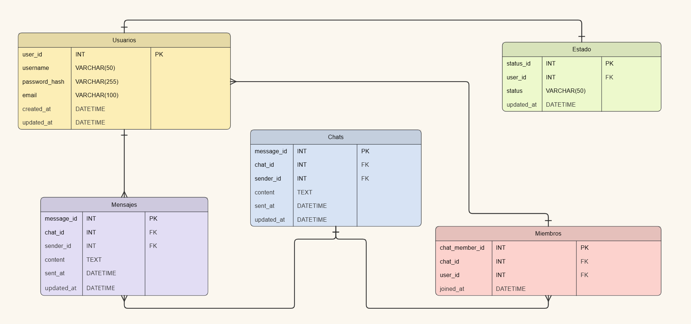

# 3.3 Modelo de Datos

La elección de las abstracciones de datos, en conjunto con las cualidades propias de un sistema de mensajería es un paso importate en la arquitectura del sistema de ClassTalk.

**Abstraccion de los Datos**: Para ClassTalk tenemos que tener las consideraciones de __Usuarios__, __Chats__, __Mensajes__, __Miembros__ y __Estado__. Cada una de estas abstracciones tendrá sus propias cualidades las cuales van relacionadas a la función o rol que cumple. Por ejemplo, __mensajes__ cuenta con el id del usuario y el id de quien lo manda, el contenido del mismo y la fecha de cuando fue enviado. 

**Organización de Datos:** Para la organización de datos, se optó por una base de datos relacional, debido al conocimiento del equipo sobre ellas.

**Base de Datos Relacional**: Se utilizará PostgreSQL debido a su soporte ante la concurrencia y la escalabilidad. Con este, podremos almacenar datos estructurados de la información del usuario. Las relaciones entre estas entidades están gestionadas mediante el uso de _primary keys_ y _forein keys_ en las tablas relacionales.

[Regresar al índice](../../README.md)
