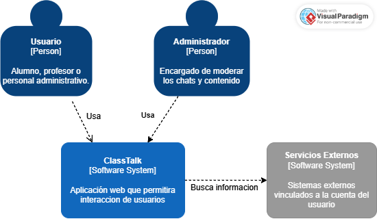
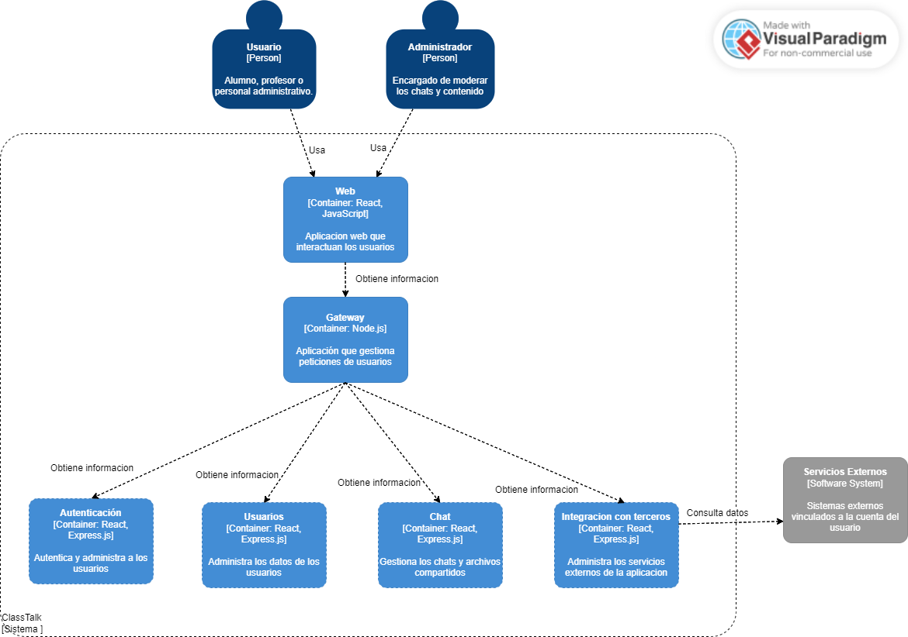

# 5 Propuesta de arquitectura (Inicial)

En esta seccion, se dara información sobre la propuesta de arquitectura inicial de la aplicación mediante el uso de modelos C4.

## 1. Diagrama de contexto

## 2. Diagrama de contenedores

## 3. Diagrama de componentes

[Regresar al índice](../../README.md)
