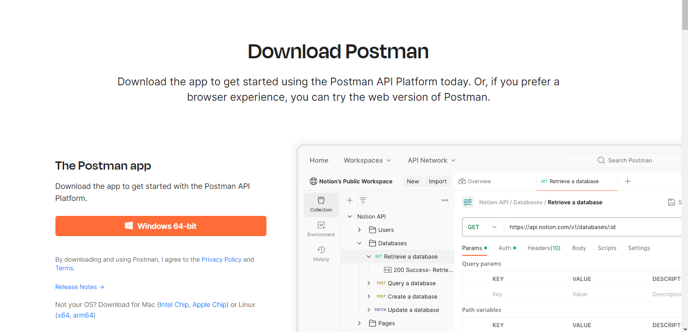

# Pruebas de Integración

## Desarrollo Conceptual

Las pruebas de integración son un proceso de prueba de software en el que se evalúan los componentes, módulos o unidades de software de una aplicación para verificar su cumplimiento en cojunto con los requisitos funcionales .

Las pruebas de integración son consideradas de segundo nivel del proceso de pruebas de software, ya que van después de las pruebas unitarias. Esta fase de pruebas es fundamental para asegurar que las diversas unidades o componentes interactúen sin errores, verificando sus funcionalidades y cómo funcionan conjuntamente como una sola entidad (Mohanan, 2022).

Este tipo de pruebas son útiles ya que ayudan a identificar problemas que no se encuentran evidentes en la implementación de un módulo específico. Esto facilita la detección de errores durante las interacciones entre varias partes del software (Schmitt, 2021).

Según _Integration testing: A detailed guide_ (2023), existen diferentes tipos de pruebas de integración, tales como:

- **Prueba Big-bang:** Durante esta prueba, se integrand **todos** los compenentes a la vez y se prueban como sistema completo.
- **Prueba de arriba hacia abajo:** En esta prueba, los componentes son testeados e integrados desde el nivel más alto al más bajo. Normalmente cuando los componentes superiores dependen de los inferiores
- **Prueba de abajo hacia arriba:** Estas pruebas consisten en la integración y testeo de los componentes desde el nivel más bajo al nivel superior.
- **Prueba sándwich:** Combinan elementos de las prueba de arriba hacia abajo y de abajo hacia arriba. Utilizando stubs y drivers para simular los componentes faltantes.

## Consideraciones Técnicas

Para el desarrollo de las pruebas de integracion se utilizara el software Postman. Este es una plataforma para construir,utilizar y testear APIs. Postman simplifica cada etapa del ciclo de vida de las APIs y facilita la colaboración, lo que permite crear APIs de manera más eficiente y rápida.

### Instalación/Configuración del Servicio

La instalacion de wordpress es sencilla, ya que solo se requiere descargar el software y vincular una cuenta para utilizarlo

### Primeros Pasos

Dentro de los primeros pasos, algunas definiciones importantes a conocer sobre Postman son el uso de colecciones, ambientes y variables

## Demo

### Escenario Práctico

Para esta demo se utilizarán API's realizadas para un software de cafeteria. Durante la demo se probaran los servicios de logueo de usuario, obtencion de los productos de un restaurante y la adicion de un nuevo producto a la carta.

### Pasos para la demo y resultados

Los pasos y los resultados del demo se podran encontrar en el siguiente video: https://youtu.be/VU4ncHc62WA

### Referencias

- Integration testing: A detailed guide. (2023, marzo 10). BrowserStack. https://www.browserstack.com/guide/integration-testing
- Mohanan, R. (2022, noviembre 21). What Is Integration Testing? Types, Tools, and Best Practices. Spiceworks.com. https://www.spiceworks.com/tech/devops/articles/what-is-integration-testing/
- Postman API platform. (s/f). Postman.com. Recuperado el 15 de mayo de 2024, de https://www.postman.com/
- Schmitt, J. (2021, diciembre 3). Unit testing vs integration testing. CircleCI. https://circleci.com/blog/unit-testing-vs-integration-testing/
