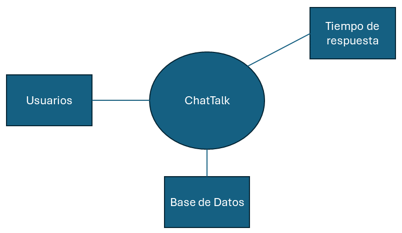

# Elegir uno o más elementos del sistema a refinar

Para este caso, no se aplica el refinamiento ya que está realizando el diseño del sistema desde cero.

Diagrama de Contexto, que se utiliza por su enfoque para descomponer los elementos en los que se deberá trabajar a detalle.

