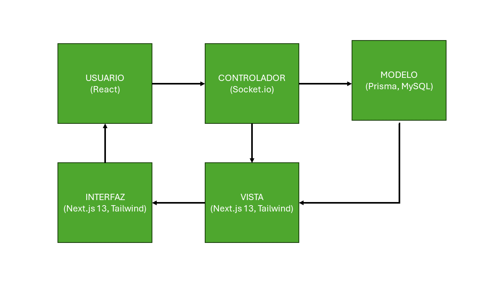

# Decisiones de Diseño

| Codigo | Decisión de Diseño                                  | Justificación                                                                                                                                                                                                      |
| ------ | --------------------------------------------------- | ------------------------------------------------------------------------------------------------------------------------------------------------------------------------------------------------------------------ |
| DEC-00 | Aplicación del Stack Tecnológico Seleccionado       | -                                                                                                                                                                                                                  |
| DEC-00 | Utilización del Modelo Vista Controlador            | -                                                                                                                                                                                                                  |
| DEC-00 | Utilización de Web Sockets                          | El uso de websockets mejora el rendimiento ante el uso del http, generando una menor sobrecarga y una menor latencia. Ante la necesidad de una comunicación inmediata, resulta una mejor opción. Util para CON-01. |
| DEC-00 | Las contraseñas de los usuarios estarán encriptadas | Es crucial que la información de los usuarios se proteja ante ataques, especialmente las. contraseñas. Esto contribuye con CON-04 y el CRN-03                                                                      |

## Diagrama del Modelo Vista Controlador

