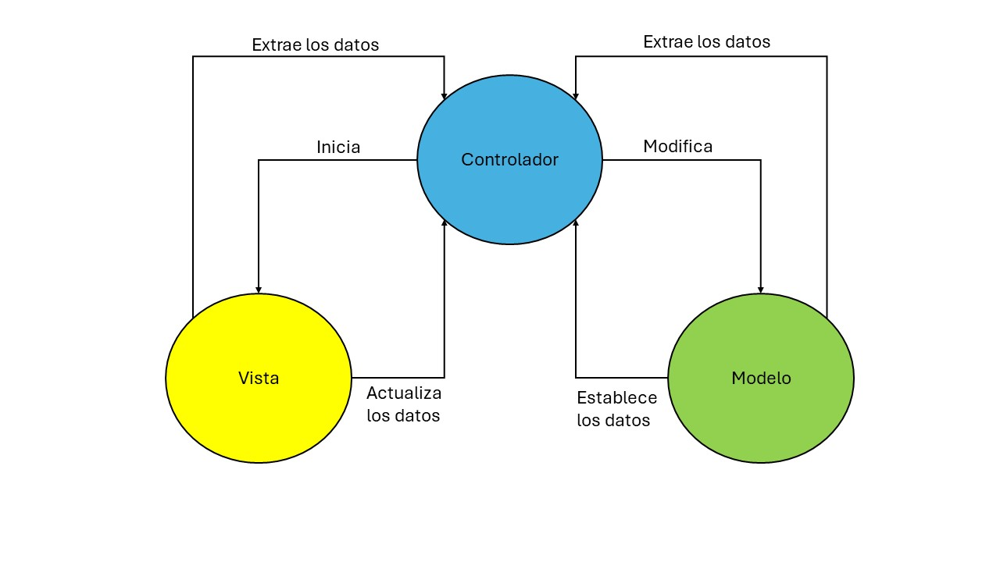

# Decisiones de Diseño

| Codigo | Decisión de Diseño                                                          | Justificación                                                                                                                                                                                                                                          |
| ------ | --------------------------------------------------------------------------- | ------------------------------------------------------------------------------------------------------------------------------------------------------------------------------------------------------------------------------------------------------ |
| DEC-01 | Se usará el Patron Modelo-Vista-Controlador                                 | Debido a que se trabajará constantemente en la interfaz de usuario, resulta clave el mantener los componentes separados. Esto ayuda con el CON-06.                                                                                                     |
| DEC-04 | Utilización de MERN (Mongo, Express, React y NodeJS)                        | El uso de un único lenguaje de programación como Javascript, la flexibilidad que ofrece MongoDB al manejo de los datos y cualidad del Event-Driven y Non-Blocking propia de NodeJS nos permiten tener mejoras en el rendimiento (util para el CON-01). |
| DEC-04 | Utilización de Web Sockets                                                  | El uso de websockets mejora el rendimiento ante el uso del http, generando una menor sobrecarga y una menor latencia. Ante la necesidad de una comunicación inmediata, resulta una mejor opción. Util para CON-01.                                     |
| DEC-04 | Las contraseñas de los usuarios estará encriptada al almacenarse en la BBDD | Es crucial que la información de los usuarios se proteja ante ataques, especialmente las. contraseñas. Esto contribuye con CON-04 y el CRN-03                                                                                                          |

Modelo Vista Controlador

