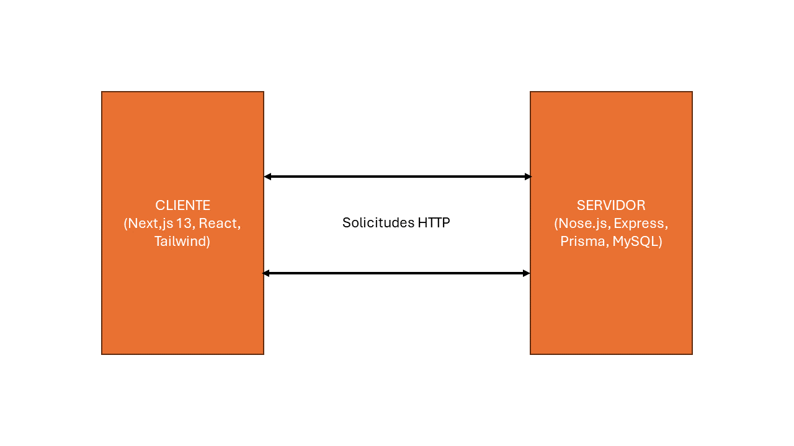

El "ProyectoArquiSoftGrupo2" ejemplifica cómo estos patrones pueden estructurar una aplicación de manera eficiente. 
El proyecto se organiza en dos partes principales: el servidor (api) y el cliente (client). Esta estructura facilita la separación de responsabilidades y permite una mayor modularidad.

1. **MVC (Modelo-Vista-Controlador):**
   - **Modelos:** Se define en la carpeta api/models y utiliza MongoDB para el almacenamiento de datos.
   - **Vistas:** Implementada en la carpeta client, gestionada por herramientas como React.
   - **Controladores:** Gestiona la lógica de negocio en Express (Node.js) para manejar las rutas y solicitudes.

2. **Cliente-Servidor:**
   - **Cliente:** La carpeta client contiene la lógica de presentación y comunicación con el servidor.
   - **Servidor:** La carpeta api implementa la lógica de negocio utilizando Express y Node.js, y se conecta a MongoDB para la persistencia de datos.

3. **Patrón de Capas:**
   - **Capa de Presentación:** Implementada en client, maneja la interfaz de usuario.
   - **Capa de Negocio:** Encapsulada en los controladores dentro de api.
   - **Capa de Datos:** Administrada por los modelos y MongoDB.

