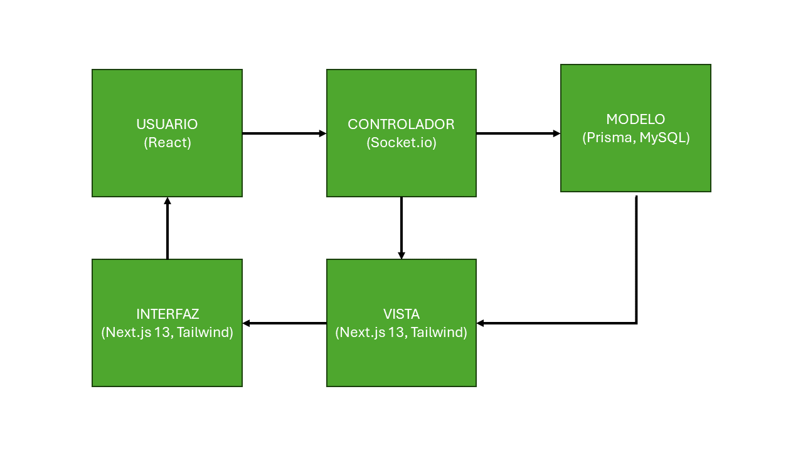

En "ClassTalk" ejemplifica cómo estos patrones pueden estructurar una aplicación de manera eficiente. 
El proyecto se organiza en dos partes principales: el servidor (api) y el cliente (client). Esta estructura facilita la separación de responsabilidades y permite una mayor modularidad.

### 1. Modelo-Vista-Controlador (MVC)
- **Modelo**: Gestiona los datos y la lógica de negocio, se utiliza Prisma y MySQL para la gestión de datos. Prisma se emplea como ORM (Object-Relational Mapping) para interactuar con la base de datos MySQL, proporcionando una forma eficiente de gestionar y consultar los datos.
- **Vista**: Muestra los datos y envía comandos del usuario al controlador. Next.js 13 y React se utilizan para la interfaz de usuario, donde Next.js proporciona el framework para el renderizado del lado del servidor y la generación de sitios estáticos, y React se utiliza para crear componentes interactivos y dinámicos de la interfaz de usuario.
- **Controlador**: Maneja la entrada del usuario y actualiza el modelo y la vista según sea necesario. Socket.io se utiliza para manejar la comunicación en tiempo real, facilitando la comunicación bidireccional entre el cliente y el servidor, permitiendo actualizaciones en tiempo real y una experiencia de usuario más interactiva.

### 2. Cliente-Servidor (Client-Server)
- **Cliente**: La aplicación frontend que interactúa con el usuario. Next.js 13, React y Tailwind para manejar la lógica de la interfaz de usuario y el diseño y la estilización de los componentes.
- **Servidor**: La aplicación backend que procesa las solicitudes del cliente y envía respuestas. Node.js y Express se utilizan para manejar las solicitudes HTTP y gestionar la lógica del servidor, mientras que Prisma y MySQL se encargan de la gestión de datos.

### 3. Arquitectura Orientada a Servicios (SOA)
- **Proveedor de Servicios**: Crea y proporciona servicios. Node.js y Prisma está diseñado para ser modular y reutilizable, facilitando la escalabilidad y el mantenimiento.
- **Consumidor de Servicios**: Utiliza los servicios. El frontend con Next.js 13 y React consume los servicios proporcionados por el backend a través de APIs, facilitando la separación de responsabilidades y la integración de diferentes servicios.
- **Registro de Servicios**: Registra y descubre servicios. Puede implementarse un registro de servicios utilizando herramientas como Consul o Eureka para gestionar la disponibilidad y el descubrimiento de servicios.

### 4. Arquitectura Multi-Tier
- **Capa de Presentación**: Maneja la interfaz de usuario. Next.js 13, React, y Tailwind son responsables de la experiencia del usuario, proporcionando una interfaz amigable y responsive.
- **Capa Lógica**: Procesa la lógica de la aplicación. Node.js y Socket.io manejan la lógica de negocio, las reglas y los procesos de la aplicación, así como la comunicación en tiempo real.
- **Capa de Datos**: Gestiona la base de datos y el almacenamiento de datos. Prisma y MySQL se encargan de la persistencia de datos y las operaciones de la base de datos, asegurando la integridad y consistencia de la información.

### 5. Broker
- **Cliente**: Solicita servicios. Next.js 13 y React envían solicitudes de servicio que son gestionadas por el broker.
- **Broker**: Gestiona la comunicación y las solicitudes de servicio. Socket.io actúa como intermediario, facilitando la comunicación entre los clientes y los servidores, manejando la lógica de enrutamiento y coordinación.
- **Servidor**: Proporciona servicios. Node.js, Prisma, y MySQL responden a las solicitudes gestionadas por el broker, proporcionando los servicios necesarios.
