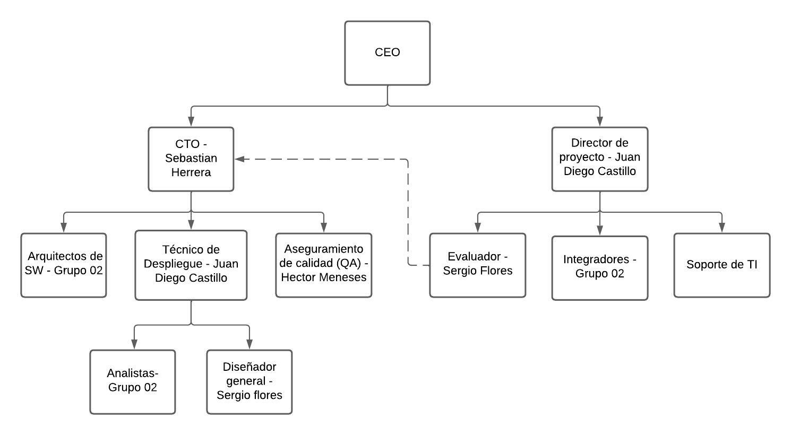
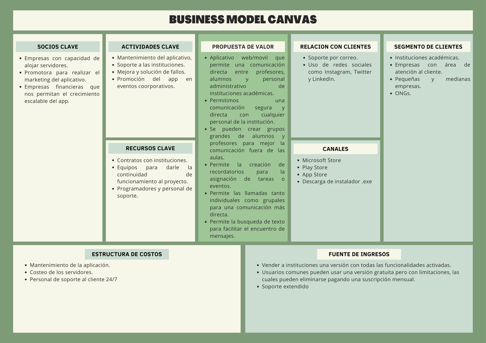

# Grupo 02
## Integrantes
- [Castillo Carnero, Juan Diego](./Integrantes/castillo/jd.md)
- [Flores Tavara, Sergio David](./Integrantes/flores/flores.md)
- [Herrera Solis, Sebastian Martin](./Integrantes/herrera/herrera.md)
- [Meneses Gutierrez, Hector Jose](./Integrantes/hector/hector.md)

## Índice

- [1. Caso de Negocio]()
    - [1.1 Generalidades]()
    - [1.2 Modelo de Negocio]()
    - [1.3 Estructura de Equipo]()
    - [1.4 Listado de Stakeholders]()
- [2. Requerimientos del Sistema]()
    - [2.1 Requerimientos Funcionales]()
    - [2.2 Requerimientos de Atributos]()
    - [2.3 Restricciones]()
- [3. Decisiones a Nivel de Arquitectura]()
    - [3.1 Asignación de Responsabilidades]()
    - [3.2 Modelo de Coordinación]()
    - [3.3 Modelo de Datos]()
    - [3.4 Mapeo entre Elementos de Arquitectura]()
    - [3.5 Elección de Tecnología]()
- [4. Tácticas]()
    - [4.1 Disponibilidad]()
    - [4.2 Mantenibilidad]()
    - [4.3 Interoperabilidad]()
    - [4.4 Rendimiento]()
    - [4.5 Seguridad]()
- [5. Propuesta de Arquitectura Inicial]()
- [6. Anexo: Tópicos en Arquitectura de Software]()
    - [6.1 Tema/Alumno]()
    - [6.2 Desarrollo Conceptual]()
    - [6.3 Consideraciones Técnicas]()
        - [6.3.1 Instalación / Configuración de Servicio]()
        - [6.3.2 Primeros Pasos]()
    - [6.4 Demo]()
        - [6.4.1 Escenario Práctico]()
        - [6.4.2 Pasos para la demo]()
        - [6.4.3 Resultados]()
- [7. Referencias]()

## Tema de proyecto
Desarrollo de un aplicativo web y movil que permita el servicio de mensajería instantánea y masiva entre estudiantes, profesores y personal administrativos de una/varias universidades. En el aplicativo se deberá de crear grupos, enviar mensajes, enviar diferentes tipos de archivos multimedia, realizar llamadas, tenes gestión de administrador, etc. Todo esto con la finalidad de poder gestionar de forma apropiada las comunicaciones en el entorno académico.
## 1.3 Estructura del Equipo

## 1.4 Stakeholders
- Analistas: Equipo de desarrollo
- Arquitecto: Arquitectos de SW
- Gestor de negocio: CEO
- Conformance checker: Asegurador de calidad (QA)
- Cliente: La entidad universitaria.
- DBA: Técnico de despliegue
- Especialista en despliegue: Técnico de despliegue
- Diseñador: Diseñador general
- Evaluador: Evaluador de producto
- Implementador: Equipo de desarrollo
- Integrador: Equipo de desarrollo
- Responsable de mantenimento: Soporte de TI
- Administrador de Línea de producto: Departamento de Innovacion
- Jefe de proyecto: Director de proyecto
- Responsable de pruebas: Evaluador de producto y QA
-  Usuarios finales: Estudiantes, profesores y jefes de practica.

## Business Model Canvas

## Stack tecnológico 

- Lenguaje de programacion Dart
- Flutter SDK
- Docker - instancia de contenedor RethinkDB 

## Requerimientos del Sistema
**Requerimientos Funcionales:**
1. **Registro e inicio de sesión con roles definidos:** La aplicación debe permitir el registro e inicio de sesión de usuarios con roles específicos: profesor, alumno y personal administrativo, cada rol tendrá diferentes permisos y funcionalidades.
2. **Perfiles de usuario:** Cada usuario tendrá un perfil con información básica como nombre, foto de perfil, rol en la institución, etc.
3. **Mensajería one-to-one:** Los usuarios podrán enviar mensajes directos a otros usuarios, independientemente de su rol.
4. **Mensajería de grupo:** Los usuarios podrán crear y unirse a grupos de chat, ya sean por curso, grupo de trabajo, etc.
5. **Gestión de cursos:** Los profesores podrán crear y gestionar cursos, agregar alumnos y personal administrativo, compartir materiales, etc.
6. **Anuncios y notificaciones:** Los profesores y el personal administrativo podrán enviar anuncios y notificaciones importantes a los grupos de estudiantes o a toda la institución.
7. **Calendario académico:** La aplicación debe incluir un calendario académico donde se muestren eventos importantes, fechas límite, horarios de clase, etc.
8. **Compartir archivos:** Todos los usuarios podrán compartir archivos multimedia, documentos, presentaciones, etc., dentro de los chats individuales o de grupo.
9. **Búsqueda de usuarios y cursos:** Los usuarios podrán buscar y encontrar a otros usuarios o cursos específicos dentro de la aplicación.
10. **Integración con sistemas académicos:** La aplicación puede integrarse con los sistemas académicos de la institución para acceder a información de calificaciones, horarios, etc.
11. **Privacidad y seguridad:** Los mensajes y archivos compartidos deben estar cifrados, y se deben implementar medidas de seguridad para proteger la privacidad de los usuarios.
12. **Notificaciones push:** Los usuarios recibirán notificaciones push en tiempo real sobre nuevos mensajes, anuncios, eventos, etc.
13. **Soporte multiplataforma:** La aplicación debe ser compatible con iOS y Android para una mejor accesibilidad.